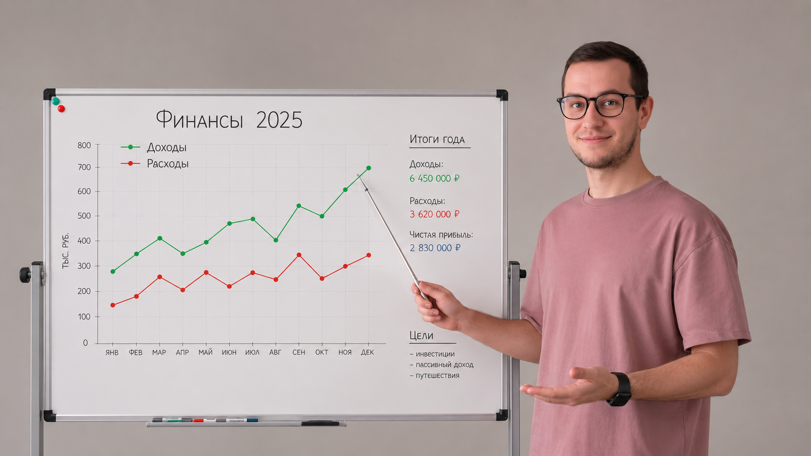

# Анализ моих финансов за 2025 г.

## Пет-проект по EDA-анализу личных финансов за период 03.2025–03.2026
[Датасет здесь](finance-2025.xlsx)  
  
[Анализ здесь](my-finance-analysis.ipynb)  

📋[Дашборды здесь]()
### ЦЕЛЬ: 
**Понять структуру расходов, выявить повторяющиеся финансовые привычки и найти точки для оптимизации бюджета.**

_В ходе анализа использовался Python, pandas и SQL_.

Что было сделано:
- очистка и подготовка данных;
- фильтрация операций (со статусом FAIL) и внутренних переводов;
- выделение расходов и создание дополнительных временных признаков;
- SQL-анализ категорий расходов;
- исследование расходов по месяцам и дням недели;
- сравнение расходов в будни и выходные;
- анализ среднего чека;
- поиск наиболее дорогих и частых операций;
- отдельный анализ транспортных и необязательных расходов;
- визуализация результатов в виде дашборда в Power BI.

Основные выводы:
* значительную часть бюджета формируют нерегулярные крупные расходы;
* транспортные траты в основном связаны с владением автомобилем;
* фастфуд и импульсные покупки являются заметной частью гибких расходов;
* расходы отличаются между буднями и выходными не только объёмом, но и структурой;
* регулярные небольшие платежи формируют существенную долю годовых расходов.

Инсайты:
1) Автомобиль — ключевая статья переменных расходов. транспортные расходы - 305 тыс., из них автоуслуги - 240 тыс., заправки - 45 тыс. Основная нагрузка идёт не на бензин, а на обслуживание автомобиля. Ддя сокращения расходов на обслуживание поменял автомобиль.
2) Супермаркеты — самая стабильная и частая категория в будни. Важно планировать покупки и  избегать импульсивных трат.
3) Самый большой потенциал оптимизации расходов -  в категории _фастфуда_. За год потрачено около 76 тыс.руб., средний чек > 800 руб.
4) Очень большие расходы приходятся на субботу. ЭТО СТРАННО.
5) Самый "затратные" месяцы - октябрь и декабрь, что объяснимо - в октябре помогал родителям с покупкой нового автомобиля и выкупил их старый автомобиль; декабрь - время покупки новогодних подарков и декора.
